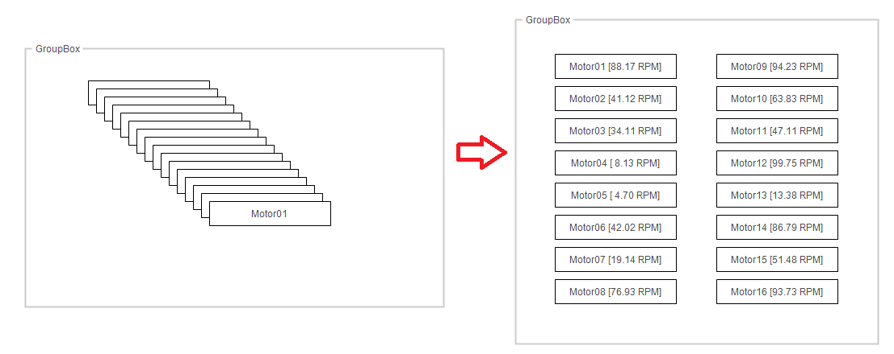
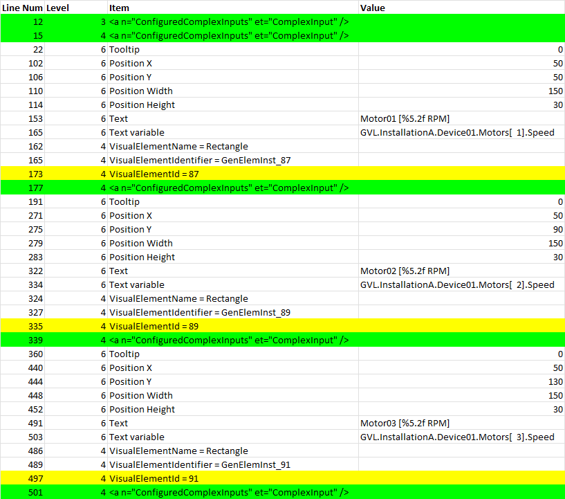
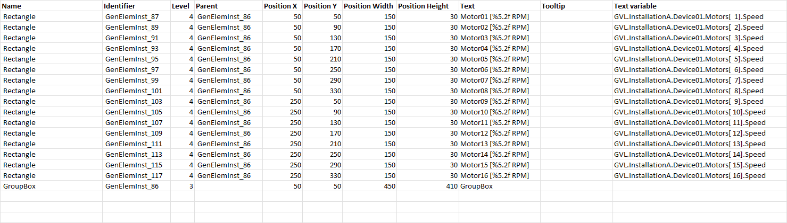

# Automate Beckhoff TwinCAT® Visualization Design with Excel

An Excel‑based automation tool that streamlines the creation and modification of **TwinCAT® Visualization** pages.  
It reads an existing visualization file, exposes all elements in structured Excel sheets, and writes the transformed data back into a new visualization file.

---

## 📌 Features

- Extract visualization elements from a TwinCAT® visualization file  
- Edit and transform visualization data directly in Excel  
- Automatically generate an updated visualization file  
- Ideal for bulk editing, rapid prototyping, and maintaining consistent UI layouts

---

## 🚀 Workflow Overview

### 1. Prepare Your Visualization Files
Create two visualization files in TwinCAT®:

- **Source Visualization** – contains all required elements with dummy data  
- **Result Visualization** – will receive the updated content generated by Excel

Ensure the source file includes every element you want to automate.

---

### 2. Configure the Excel Tool
Open the **Config** sheet and fill in:

- Full path to the visualization files  
- Source file name  
- Result file name  

---

### 3. Read the Source Visualization
Click **`ReadVisualizationFile`**.

Excel will populate:

- **List** – raw extracted visualization data  
- **ListTrans** – a structured, transformation‑friendly version of the data

---

### 4. Transform the Visualization Data
Modify **ListTrans** according to your design needs.

**Recommended:**  
Create a backup copy of the sheet before applying large changes.

---

### 5. Write the Updated Visualization
Click **`WriteVisualizationFile`**.

Excel will generate the updated visualization file and write all transformed elements into the **result visualization**.

---

## 🎯 Purpose

This tool is designed for:

- Automating repetitive visualization design tasks  
- Bulk editing visualization elements  
- Maintaining consistent UI structures across projects  
- Rapid prototyping of  TwinCAT® visualization layouts  

  

  

  

